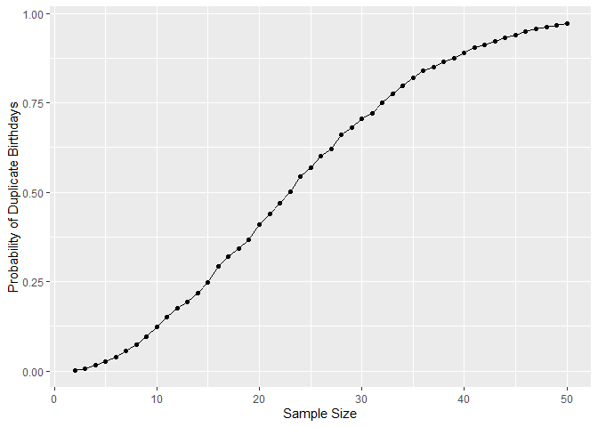
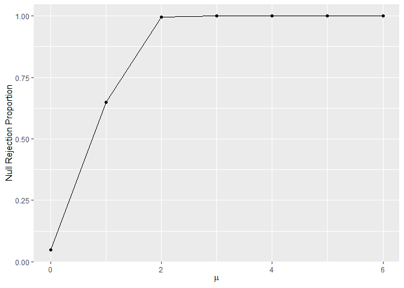
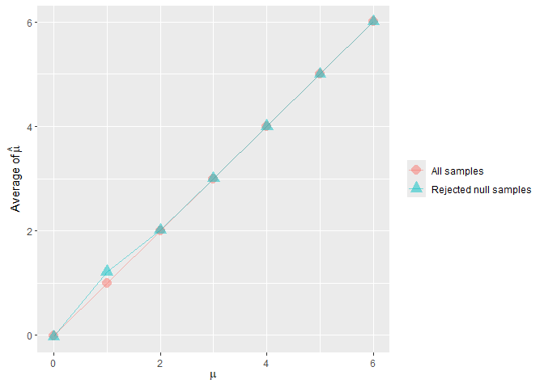
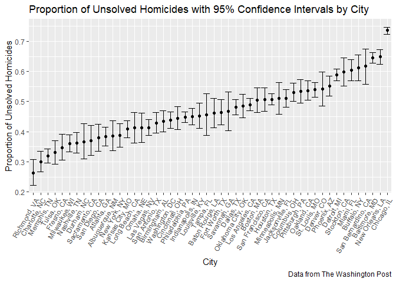

P8105 Data Science I - Homework 5
================
Heng Hu (hh2648)
2025-11-08

``` r
# Setup
library(tidyverse)
set.seed(2648)
```

## Problem 1

``` r
# Setup
iter = 10000 #10000

# Function to test if there are duplicate birthdays among a group of n people.

dob_dup = function(n) {
  
  dob = sample(1:365, n, replace = TRUE)
  dob_dup = any(duplicated(dob))
    
}

# Simulating 10000 times for each group size between 2 and 50, and compute the probabilities across sample sizes.

sim_dob_dup = expand_grid(
    sample_size = 2:50,
    iter = 1:iter
  ) |> 
  mutate(dob_dup_fl = map(sample_size, dob_dup)) |> 
  unnest(cols = dob_dup_fl) |> 
  group_by(sample_size) |> 
  summarise(prob = mean(dob_dup_fl))

sim_dob_dup |> 
  knitr::kable()
```

| sample_size |   prob |
|------------:|-------:|
|           2 | 0.0031 |
|           3 | 0.0077 |
|           4 | 0.0158 |
|           5 | 0.0259 |
|           6 | 0.0400 |
|           7 | 0.0576 |
|           8 | 0.0742 |
|           9 | 0.0965 |
|          10 | 0.1233 |
|          11 | 0.1514 |
|          12 | 0.1752 |
|          13 | 0.1941 |
|          14 | 0.2187 |
|          15 | 0.2491 |
|          16 | 0.2919 |
|          17 | 0.3200 |
|          18 | 0.3434 |
|          19 | 0.3686 |
|          20 | 0.4103 |
|          21 | 0.4402 |
|          22 | 0.4691 |
|          23 | 0.5021 |
|          24 | 0.5452 |
|          25 | 0.5688 |
|          26 | 0.6020 |
|          27 | 0.6211 |
|          28 | 0.6613 |
|          29 | 0.6821 |
|          30 | 0.7046 |
|          31 | 0.7199 |
|          32 | 0.7503 |
|          33 | 0.7747 |
|          34 | 0.7985 |
|          35 | 0.8192 |
|          36 | 0.8412 |
|          37 | 0.8500 |
|          38 | 0.8639 |
|          39 | 0.8745 |
|          40 | 0.8892 |
|          41 | 0.9055 |
|          42 | 0.9121 |
|          43 | 0.9230 |
|          44 | 0.9315 |
|          45 | 0.9404 |
|          46 | 0.9491 |
|          47 | 0.9560 |
|          48 | 0.9608 |
|          49 | 0.9679 |
|          50 | 0.9712 |

``` r
# Make a plot showing the probability as a function of group size.

sim_dob_dup |> 
  ggplot(aes(x = sample_size, y = prob)) +
  geom_point() +
  geom_line() +
  labs(y = "Probability of Duplicate Birthdays",
       x = "Sample Size")
```

<!-- -->

We can conclude that the probability of two or more people sharing the
same birthday increases as the sample size grows. The probability
reaches about 50% when there are 23 people and rises to nearly 100% when
the sample size reaches 50.

## Problem 2

``` r
# Setup

n = 30
sigma = 5
iter = 5000 #5000

# Function to report mu hat and p value from a t-test.

my_ttest = function(mu) {
  
  x = rnorm(n = n, mean = mu, sd = sqrt(sigma))
  
  result = t.test(x, mu = 0, conf.level = 0.95) |> 
    broom::tidy() |> 
    select(estimate, p.value) |> 
    rename(mu_hat = estimate,
           p_value = p.value) |> 
    mutate(reject_h0 = ifelse(p_value < 0.05, TRUE, FALSE))
  
}

# Simulating 5,000 times for mu ranging from 0 to 6.

sim_ttest = expand_grid(
    mu = 0:6,
    iter = 1:iter
  ) |> 
  mutate(ttest = map(mu, my_ttest)) |> 
  unnest(cols = ttest)

# Make a plot showing the proportion of times the null was rejected.

sim_ttest |> 
  group_by(mu) |> 
  summarise(prop = mean(reject_h0)) |> 
  ggplot(aes(x = mu, y = prop)) +
  geom_point() +
  geom_line() +
  labs(x = expression(mu),
       y = "Null Rejection Proportion")
```

<!-- -->

As the difference between 0 and the true value of $\mu$ increases, the
effect size becomes larger, if the $\sigma$ remains constant. As a
result, the larger effect size leads to greater statistical power. For
$\mu=0$, the proportion of times the null hypothesis is rejected equals
$\alpha$, regardless of the sample size.

``` r
# Make a plot showing the average estimate of mu hat in all samples and only in samples for which the null was rejected.

sim_ttest |> 
  mutate(mu_hat_h1 = ifelse(reject_h0, mu_hat, NA)) |> 
  group_by(mu) |> 
  summarise(avg_mu_hat_all = mean(mu_hat),
            avg_mu_hat_h1 = mean(mu_hat_h1, na.rm = TRUE)) |> 
  pivot_longer(cols = starts_with("avg_mu_hat"),
               names_to = "type",
               values_to = "avg_mu_hat",
               names_prefix = "avg_mu_hat_") |> 
  mutate(type = ifelse(type == "all", "All samples", "Rejected null samples")) |> 
  ggplot(aes(x = mu, y = avg_mu_hat, colour = type, shape = type)) +
  geom_point(alpha = 0.5, size = 4) +
  geom_line(alpha = 0.5) +
  labs(x = expression(mu),
       y = expression("Average of " * hat(mu)),
       colour = NULL,
       shape = NULL)
```

<!-- -->

- When $\mu=0$, the estimates $\hat{\mu}$s for which the null is
  rejected are distributed symmetrically around 0. Thus, the sample
  average of $\hat{\mu}$ is close to 0.

- When $\mu$ is close to 0, for example $\mu=1$ in the plot, the samples
  that rejected $H_0$ are more likely to have larger $\hat{\mu}$s, which
  leads to the sample average of $\hat{\mu}$ larger than $\mu$.

- When $\mu$ is much larger than 0, such as between 2 and 6 in the plot,
  most samples rejected $H_0$. Therefore, the sample average of
  $\hat{\mu}$ is close to $\mu$.

## Problem 3

``` r
# Read and tidy the data
origin_homi = read_csv(file = "./data/homicide-data.csv") 

homicides = origin_homi |> 
   mutate(state = toupper(state),
          state = ifelse(city == "Tulsa", "OK", state),
          city_state = str_c(city, ", ", state),
          reported_date = case_match(reported_date,
                                     201511018 ~ 20151018,
                                     201511105 ~ 20151105,
                                     .default = reported_date),
          reported_date = ymd(reported_date),
          victim_race = as.factor(victim_race),
          victim_age = as.numeric(victim_age),
          victim_sex = as.factor(victim_sex),
          disposition = as.factor(disposition),
          unsolved = ifelse(disposition %in% c("Open/No arrest", "Closed without arrest"), TRUE, FALSE))
```

The original data has `52179` rows and `12` variables. Each record
contains basic information about the victim, such as name, sex, age, and
race, for each homicide case. In `disposition` variable, the cases were
catagorized into “Closed by arrest”, “Closed without arrest” and
“Open/No arrest”. Two invalid `reported_date` values were found in the
raw data and corrected during the data tidying step. Additionally, one
record from `Tulsa` was incorrectly labeled as being in Alabama (`AL`).

**Table of the total number of homicides by city:**

``` r
total_homi = homicides |> 
  group_by(city_state) |>  
  summarize(total_num = n())

total_homi |> 
  knitr::kable(col.names = c("City", "Number of Homicides"))
```

| City               | Number of Homicides |
|:-------------------|--------------------:|
| Albuquerque, NM    |                 378 |
| Atlanta, GA        |                 973 |
| Baltimore, MD      |                2827 |
| Baton Rouge, LA    |                 424 |
| Birmingham, AL     |                 800 |
| Boston, MA         |                 614 |
| Buffalo, NY        |                 521 |
| Charlotte, NC      |                 687 |
| Chicago, IL        |                5535 |
| Cincinnati, OH     |                 694 |
| Columbus, OH       |                1084 |
| Dallas, TX         |                1567 |
| Denver, CO         |                 312 |
| Detroit, MI        |                2519 |
| Durham, NC         |                 276 |
| Fort Worth, TX     |                 549 |
| Fresno, CA         |                 487 |
| Houston, TX        |                2942 |
| Indianapolis, IN   |                1322 |
| Jacksonville, FL   |                1168 |
| Kansas City, MO    |                1190 |
| Las Vegas, NV      |                1381 |
| Long Beach, CA     |                 378 |
| Los Angeles, CA    |                2257 |
| Louisville, KY     |                 576 |
| Memphis, TN        |                1514 |
| Miami, FL          |                 744 |
| Milwaukee, WI      |                1115 |
| Minneapolis, MN    |                 366 |
| Nashville, TN      |                 767 |
| New Orleans, LA    |                1434 |
| New York, NY       |                 627 |
| Oakland, CA        |                 947 |
| Oklahoma City, OK  |                 672 |
| Omaha, NE          |                 409 |
| Philadelphia, PA   |                3037 |
| Phoenix, AZ        |                 914 |
| Pittsburgh, PA     |                 631 |
| Richmond, VA       |                 429 |
| Sacramento, CA     |                 376 |
| San Antonio, TX    |                 833 |
| San Bernardino, CA |                 275 |
| San Diego, CA      |                 461 |
| San Francisco, CA  |                 663 |
| Savannah, GA       |                 246 |
| St. Louis, MO      |                1677 |
| Stockton, CA       |                 444 |
| Tampa, FL          |                 208 |
| Tulsa, OK          |                 584 |
| Washington, DC     |                1345 |

**Table of the number of unsolved homicides by city:**

``` r
unsolved_homi = homicides |> 
  filter(unsolved) |> 
  group_by(city_state) |>  
  summarize(unsolved_num = n())

unsolved_homi |> 
  knitr::kable(col.names = c("City", "Number of Unsolved Homicides"))
```

| City               | Number of Unsolved Homicides |
|:-------------------|-----------------------------:|
| Albuquerque, NM    |                          146 |
| Atlanta, GA        |                          373 |
| Baltimore, MD      |                         1825 |
| Baton Rouge, LA    |                          196 |
| Birmingham, AL     |                          347 |
| Boston, MA         |                          310 |
| Buffalo, NY        |                          319 |
| Charlotte, NC      |                          206 |
| Chicago, IL        |                         4073 |
| Cincinnati, OH     |                          309 |
| Columbus, OH       |                          575 |
| Dallas, TX         |                          754 |
| Denver, CO         |                          169 |
| Detroit, MI        |                         1482 |
| Durham, NC         |                          101 |
| Fort Worth, TX     |                          255 |
| Fresno, CA         |                          169 |
| Houston, TX        |                         1493 |
| Indianapolis, IN   |                          594 |
| Jacksonville, FL   |                          597 |
| Kansas City, MO    |                          486 |
| Las Vegas, NV      |                          572 |
| Long Beach, CA     |                          156 |
| Los Angeles, CA    |                         1106 |
| Louisville, KY     |                          261 |
| Memphis, TN        |                          483 |
| Miami, FL          |                          450 |
| Milwaukee, WI      |                          403 |
| Minneapolis, MN    |                          187 |
| Nashville, TN      |                          278 |
| New Orleans, LA    |                          930 |
| New York, NY       |                          243 |
| Oakland, CA        |                          508 |
| Oklahoma City, OK  |                          326 |
| Omaha, NE          |                          169 |
| Philadelphia, PA   |                         1360 |
| Phoenix, AZ        |                          504 |
| Pittsburgh, PA     |                          337 |
| Richmond, VA       |                          113 |
| Sacramento, CA     |                          139 |
| San Antonio, TX    |                          357 |
| San Bernardino, CA |                          170 |
| San Diego, CA      |                          175 |
| San Francisco, CA  |                          336 |
| Savannah, GA       |                          115 |
| St. Louis, MO      |                          905 |
| Stockton, CA       |                          266 |
| Tampa, FL          |                           95 |
| Tulsa, OK          |                          193 |
| Washington, DC     |                          589 |

**For the city of Baltimore, MD, use the `prop.test` to estimate the
proportion of unsolved homicides and its 95% CI.**

``` r
all_homi = inner_join(unsolved_homi, total_homi, by = "city_state" )

baltimore_homi = all_homi |> 
  filter(city_state == "Baltimore, MD")

baltimore_prop = prop.test(baltimore_homi$unsolved_num, baltimore_homi$total_num) |> 
  broom::tidy() |> 
  select(estimate, conf.low, conf.high) |> 
  janitor::clean_names()

baltimore_prop |> 
  knitr::kable(col.names = c("Estimate", "Lower 95% CI", "Upper 95% CI"),
               digits = 3)
```

| Estimate | Lower 95% CI | Upper 95% CI |
|---------:|-------------:|-------------:|
|    0.646 |        0.628 |        0.663 |

**Apply the proportion estimation to all cities.**

``` r
# Create function to estimate the proportion and 95% CI.

my_proptest = function(x, n) {

  prop = prop.test(x, n) |> 
  broom::tidy() |> 
  select(estimate, conf.low, conf.high) |> 
  janitor::clean_names()
  
}

# Apply it to all cities.

all_prop = all_homi |> 
  mutate(prop_test = map2(unsolved_num, total_num, my_proptest)) |> 
  unnest(cols = prop_test) |> 
  select(city_state, estimate, conf_low, conf_high)

# Make a plot to show the estimates and CIs for each city.

all_prop |> 
  ggplot(aes(x = fct_reorder(city_state, estimate), y = estimate)) +
  geom_point() +
  geom_errorbar(mapping = aes(ymax = conf_high, ymin = conf_low)) +
  labs(
    title = "Proportion of Unsolved Homicides with 95% Confidence Intervals by City",
    x = "City",
    y = "Proportion of Unsolved Homicides",
    caption = "Data from The Washington Post"
  ) +
  theme(axis.text.x = element_text(angle = 60, hjust = 1))
```

<!-- -->
